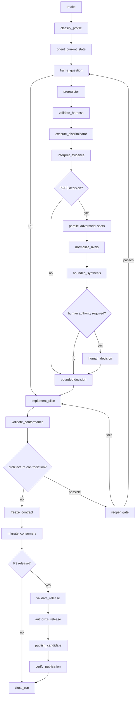

# ADSP 2.0 Portable Orchestration Contract

**Version:** 2.0 candidate
**Status:** Companion specification; not project operating authority until ADSP 2 is adopted
**Normative source:** `Adversarial_Discovery_and_Solidification_Protocol_v2.0.md`
**State schema:** `Adversarial_Discovery_and_Solidification_Protocol_state_v2.0.schema.json`

---

## 1. Purpose

This document defines how to execute ADSP 2 without binding it to one model,
agent framework, workflow engine, editor, or CI system.

A conforming orchestrator may be:

- a human following a checklist;
- a VS Code coding agent;
- a CI workflow;
- LangGraph;
- Temporal;
- a custom event-sourced state machine.

The engine coordinates evidence. It does not decide product value, security risk,
legal posture, public contract freezes, or releases unless an identified human
authority explicitly delegates that decision.

---

## 2. Design constraints

### 2.1 State is authoritative; chat is not

The canonical run state is a versioned document conforming to the v2 state
schema. Chat transcripts, reviewer prose, terminal output, and model memory are
inputs or evidence references, not authoritative state.

Every node reads one state version and proposes one transition. The reducer is
the only writer of canonical state.

### 2.2 Append events; derive status

Transitions append an event containing:

```text
sequence
timestamp
actor
action
fromStage
toStage
evidenceRefs
note
```

Mutable summary fields (`run.stage`, `run.status`, current claim status) are
projections of accepted events. An orchestrator SHOULD retain prior state
versions or event history so a summary cannot erase a correction.

### 2.3 Idempotency

Every side-effecting node has an idempotency key:

```text
run-id / stage / node-id / input-digest
```

Re-execution with the same key returns the existing receipt. A changed revision,
dirty patch, prompt packet, command, toolchain, or input artifact changes the
digest and requires new evidence.

### 2.4 Evidence is immutable

An evidence receipt is append-only. If interpretation changes, append a new
interpretation or superseding claim; do not mutate the raw observation.

A failed command is evidence. Retrying does not erase it.

### 2.5 One stage transition per write

A node may attach multiple evidence receipts but proposes at most one stage
transition. This prevents a single model response from framing, observing,
interpreting, deciding, freezing, and releasing without independent guards.

### 2.6 Human authority is explicit

A human gate records:

```text
authority domain
identity
decision
scope
timestamp
state digest
```

Silence, prior approval of a different revision, and model confidence are not
authorization.

---

## 3. Canonical node interface

A conforming node accepts:

```ts
interface NodeInput {
  readonly state: AdspRunState;
  readonly stateDigest: string;
  readonly nodeId: string;
  readonly allowedTools: readonly string[];
  readonly contextPolicy: ContextPolicy;
}
```

It returns a proposal, never an in-place mutation:

```ts
interface NodeProposal {
  readonly expectedStateDigest: string;
  readonly events: readonly ProposedEvent[];
  readonly evidence: readonly EvidenceReceipt[];
  readonly patches: readonly JsonPatchOperation[];
  readonly requestedTransition?: {
    readonly from: Stage;
    readonly to: Stage;
  };
  readonly requiredHumanGate?: HumanGateRequest;
  readonly status: 'PROPOSED' | 'NO_CHANGE' | 'BLOCKED' | 'ERRORED';
}
```

The reducer rejects a proposal when:

- `expectedStateDigest` does not match current state;
- a patch alters immutable evidence or prior events;
- the transition is illegal;
- the transition guard is unsatisfied;
- an `ORPHANED` invariant would close;
- a required human authority is missing;
- references point to nonexistent state IDs;
- event sequence or timestamps regress;
- the proposal stages or commits paths not listed as reviewed.

---

## 4. Reducer invariants

JSON Schema validates structure. The reducer validates relationships and
transitions that JSON Schema cannot reliably express.

### REF-01 — Reference integrity

Every `*Ref` and `*Refs` value resolves to an object with that ID in the same
state or an immutable external receipt registry.

### REF-02 — Event monotonicity

Event `sequence` starts at 1 and increases by exactly one. Event timestamps do
not move backward.

### REF-03 — Stage consistency

The last accepted event's `toStage` equals `run.stage`. `fromStage` equals the
prior stage except for initial intake.

### REF-04 — Evidence immutability

An existing evidence ID cannot change observation, inputs, revision, hashes,
environment, or observed time. A correction uses a new receipt and claim
supersession.

### REF-05 — Claim monotonicity

`FALSIFIED`, `SUPERSEDED`, and `RETIRED_HISTORICAL_ONLY` claims cannot return to
open. Reconsideration creates a new claim linked by `supersedes`.

### REF-06 — Absence controls

A falsifier with `absenceClaim: true` must reference a passed positive control.
Async absence also references a passed temporal-authority control.

### REF-07 — Mechanism claim integrity

Evidence supporting a mechanism claim has `REACH`, `READ`, and `DISCRIMINATE`
all `PROVEN`, unless the claim explicitly limits itself to an observation that
does not identify mechanism.

### REF-08 — Type evidence integrity

Type evidence records checker inclusion and public boundary where applicable.
Any evidence-erasing cast marks the evidence `QUARANTINED` unless the cast is the
subject under test.

### REF-09 — Carrier closure

A run cannot enter `FROZEN`, `RELEASE_READY`, `RELEASED`, or `CLOSED` while an
invariant is `ORPHANED`.

### REF-10 — Reopen integrity

`REOPEN` mode and `REOPENED` disposition require every CORE-08 field. Otherwise
the reducer returns the run to `IMPLEMENTATION` or `STOPPED`.

### REF-11 — Release identity

A release candidate marked immutable cannot change revision, tag, artifact
hashes, or validation receipts. A new candidate receives a new ID.

### REF-12 — Registry retry integrity

Skipping an existing registry version requires exact candidate/registry
integrity equality. Missing metadata, lookup failure, or mismatch blocks.

### REF-13 — Reviewed write set

A commit or artifact-write proposal lists exact paths reviewed. Wildcard staging
requires a receipt proving every matched path was reviewed.

### REF-14 — Dirty-state continuity

If orientation recorded foreign dirty paths, implementation and commit proposals
preserve them. A changed foreign patch invalidates prior diff review and requires
reorientation.

### REF-15 — Gate liveness

A custom gate counted as `PROVEN` references a relevant known-bad receipt. A
P3 release references one composed register run with zero `BLIND` or `ERRORED`
gates.

---

## 5. Node catalog

Nodes are capabilities, not mandatory microservices. A P0 implementation may
combine several pure checks locally; P2/P3 preserves context separation where it
matters.

| Node                    | Reads                            | Produces                                 | Side effects                     |
| ----------------------- | -------------------------------- | ---------------------------------------- | -------------------------------- |
| `classify_profile`      | request, risk envelope           | profile + rationale                      | none                             |
| `orient_current_state`  | repository, controllers, history | orientation snapshot                     | read-only tools                  |
| `frame_question`        | orientation, request             | property/owner question                  | none                             |
| `preregister`           | question                         | hypotheses, falsifiers, controls, budget | none                             |
| `validate_harness`      | falsifiers, controls             | control evidence                         | executable probes                |
| `execute_discriminator` | controlled plan                  | raw observation receipts                 | executable probes                |
| `interpret_evidence`    | immutable observations           | claims, inference, limitations           | none                             |
| `run_killer`            | frozen packet                    | independent review receipt               | isolated model/human             |
| `run_absence_architect` | frozen packet                    | independent review receipt               | isolated model/human             |
| `run_defender`          | frozen packet                    | independent review receipt               | isolated model/human             |
| `normalize_rivals`      | raw reviews                      | rival packets                            | deterministic transform + review |
| `bounded_synthesis`     | packet, raw reviews, rivals      | bounded decision proposal                | isolated interpreter             |
| `human_decision`        | decision proposal                | authority receipt                        | human interaction                |
| `implement_slice`       | decision/freeze, code            | code patch + focused evidence            | repository writes                |
| `validate_conformance`  | patch, requirements              | permanent conformance receipts           | tests/typecheck/build            |
| `classify_carriers`     | retired behavior/tests           | carrier states                           | analysis                         |
| `freeze_contract`       | decision, conformance, carriers  | freeze record                            | state write only                 |
| `migrate_consumers`     | freeze, callers                  | migration patch/evidence                 | repository writes                |
| `validate_release`      | candidate state                  | release evidence                         | build/package/consumer           |
| `authorize_release`     | release-ready state              | human release receipt                    | human interaction                |
| `publish_candidate`     | authorization, exact candidate   | registry receipts                        | external registry write          |
| `verify_publication`    | candidate + registry             | integrity + consumer receipts            | registry/consumer reads          |
| `close_run`             | all obligations                  | closure event                            | none                             |

### Side-effect classification

```text
PURE              state analysis only
READ_ONLY         repository/web/registry reads
REVERSIBLE_WRITE  workspace patch or generated artifact
IRREVERSIBLE      publish, tag, destructive migration, external notification
```

`IRREVERSIBLE` nodes require a human gate bound to the exact state digest.

---

## 6. Context-isolation policies

### Full context

Use for orientation and implementation. Includes current code, controllers,
instructions, and task request.

### Frozen packet

Use for adversarial seats. Includes only quoted premises, candidate property,
opposite contract, row scope, profile, and forbidden-context list.

### Rival packet

Use for defender pass 2. Includes normalized rival claim, premises, covered
capability, falsifier, and non-claims. Excludes rhetoric, verdict, author
identity, and desired synthesis.

### Artifact-only

Use for release verification and blind review. Includes exact diff, tarball,
declarations, logs, or state receipts without implementation rationale.

### Null context

Use for independent known-bad controls where expected output must not be leaked.

Context policy is part of the node input digest. Expanding context invalidates
claims of reviewer independence.

---

## 7. Parallelism

Parallelize only nodes that do not write the same authority.

Safe examples:

- killer, absence architect, and defender seats;
- independent read-only artifact checks;
- tests for disjoint projects when resource topology permits;
- documentation link and numeric-claim checks.

Unsafe examples:

- two implementation agents writing the same files;
- concurrent decisions on one claim;
- release build and mutation build sharing output directories;
- parallel memory-heavy suites beyond measured CI capacity;
- publication while candidate validation is still changing.

The join node receives all receipts and records missing, errored, contaminated,
or timed-out seats explicitly. It does not treat missing opposition as support.

---

## 8. Retry and failure policy

### Pure/read-only node

Retry transient infrastructure failures with bounded exponential backoff. Keep
all attempt receipts. A retry that changes inputs receives a new idempotency key.

### Reversible workspace write

Before retry:

1. compare current state digest and dirty patch;
2. prove prior write either completed or was rolled back;
3. preserve foreign work;
4. reorient if anything changed.

### Test or gate

A failure is evidence, not a stop by itself. Repair locally when semantics are
unambiguous. Stop when repair requires a product/API/architecture decision.

### Publication

Do not blindly retry. Resolve existing version metadata and compare integrity.
Proceed only on equality according to the release module; otherwise abort.

### Reviewer/model failure

Record `ERRORED`. A replacement seat may run with the same packet and a new
review ID. Do not count the failed seat as opposition or support.

---

## 9. LangGraph mapping

LangGraph is a suitable implementation because ADSP is a guarded state machine
with parallel independent seats and durable checkpoints. It is not required.

### Suggested graph



### State reducer

Use an annotated state whose fields merge by policy:

```text
append-only: evidence, reviews, decisions, validations, events
replace-if-digest-matches: run summary, question, budget, implementation
monotonic-status: claims, controls, invariants, release
immutable-after-set: evidence observations, freeze record, candidate hashes
```

### Interrupts

Human interrupts are required for:

- unlabeled product-value decision;
- multiple viable public APIs or owners;
- architecture reopen approval;
- risk/security/legal acceptance;
- irreversible writes;
- release authorization.

### Checkpoint storage

Store state and large artifacts separately:

```text
run state       small JSON document
raw logs        content-addressed blobs
patches         Git commit/diff or content-addressed patch
packages        artifact store with SHA-512
review output   immutable blob referenced by state
```

Do not place megabyte logs or tarballs inside graph state.

### Minimal pseudocode

```python
classify = node(classify_profile)
orient = node(orient_current_state)
frame = node(frame_question)

builder.add_edge(START, "classify")
builder.add_edge("classify", "orient")
builder.add_edge("orient", "frame")
builder.add_conditional_edges("frame", route_by_profile)

builder.add_parallel(
    "adversarial",
    ["killer", "absence_architect", "defender"],
    join="normalize_rivals",
)

builder.add_conditional_edges("validate_conformance", route_reopen_or_freeze)
builder.add_interrupt("human_decision")
builder.add_interrupt("authorize_release")
```

The reducer and transition guards remain authoritative. Node prompts are
replaceable implementation details.

---

## 10. Human-checklist mapping

A project without a graph engine can execute the same contract:

1. Create one run-state JSON document.
2. Record profile, mode, revision, and dirty paths.
3. Fill only fields required by the selected profile/modules.
4. Store raw outputs separately and reference them as evidence.
5. Ask reviewers with frozen packets; append their receipts.
6. Apply transition guards manually before changing `run.stage`.
7. Require signed approval text for human gates.
8. Validate schema and semantic invariants before freeze/release.

The graph is convenience. The evidence boundaries are the method.

---

## 11. Conformance levels

### L0 — Compatible vocabulary

Uses ADSP terms but has no structured state or transition validation. Not
sufficient for claims of protocol conformance.

### L1 — Structured

Uses the v2 state schema, core rules, profile classification, and evidence
receipts.

### L2 — Guarded

Adds semantic reducer invariants, actual positive controls, carrier blocking,
and human gates.

### L3 — Release-grade

Adds exact artifact chain, gate liveness, packed consumers, immutable candidate,
idempotent publication, registry integrity, and post-publication consumer proof.

An orchestrator reports its conformance level and unsupported modules. It must
not call an L1 checklist “fully automated ADSP.”

---

## 12. Security and privacy

- Never store secrets in run state, evidence receipts, prompts, or logs.
- Reference secret-backed operations by opaque receipt ID.
- Minimize source/context sent to external models.
- Record model/provider and context policy when policy permits, but do not treat
  vendor identity as evidence quality.
- Sanitize raw logs before durable storage.
- Require least-privilege credentials for release nodes.
- Separate read-only analysis tools from write/publish tools.
- Treat prompt injection from repository/web content as untrusted input; frozen
  protocol and tool policy outrank artifact prose.

---

## 13. Orchestrator acceptance tests

A conforming implementation should prove at least these cases:

1. P0 reaches closure without matrices or adversarial seats.
2. P2 cannot observe without falsifier and control.
3. An absence falsifier without positive control is rejected.
4. A mechanism claim lacking DISCRIMINATE is bounded or quarantined.
5. An `ORPHANED` invariant blocks freeze.
6. Implementation cannot reopen architecture on difficulty alone.
7. Parallel reviewer outputs remain isolated until normalization.
8. A stale state digest rejects a workspace patch.
9. A failed disposer does not erase the primary test failure.
10. A blind custom gate blocks P3 release readiness.
11. A changed immutable candidate hash requires a new candidate ID.
12. Registry mismatch blocks publication retry.
13. A foreign dirty-path change forces reorientation.
14. Missing human release authority blocks publication.
15. A successful post-publication consumer closes the run.

---

## Final constraint

> **The orchestrator may automate transitions. It may not automate away the
> evidence required to justify them.**
