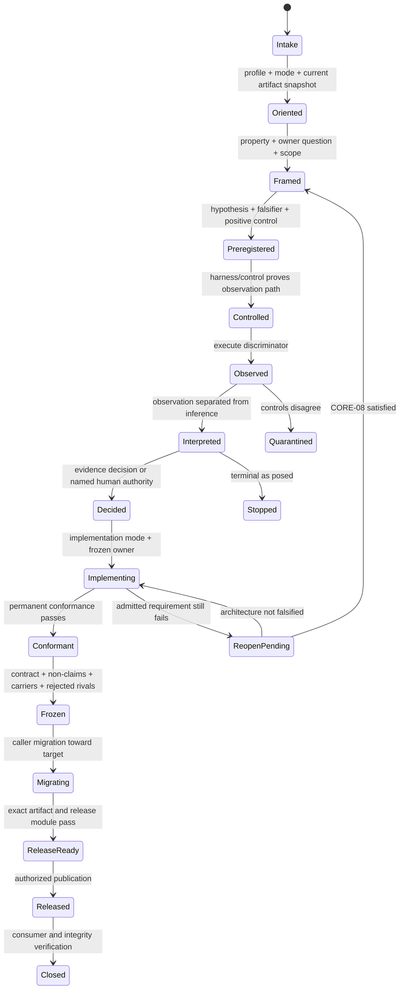

# Adversarial Discovery & Solidification Protocol 2.0

## A proportional falsification and assurance profile for high-risk engineering

**Version:** 2.0 candidate
**Status:** Candidate protocol; not project operating authority until explicitly adopted
**Evidence cut:** SignalTree v15 through 2026-09-03
**Supersedes:** Nothing while candidate. ADSP v1.1 remains immutable historical evidence.
**Companion artifacts:**

- `Adversarial_Discovery_and_Solidification_Protocol_rulebook_v2.0.yaml`
- `Adversarial_Discovery_and_Solidification_Protocol_state_v2.0.schema.json`
- `Adversarial_Discovery_and_Solidification_Protocol_orchestration_v2.0.md`

---

## Executive decision

ADSP is valuable for decisions where a wrong conclusion can change a public
contract, corrupt durable truth, break identity or lifecycle, invalidate a
migration, or publish a materially false claim. It is wasteful when applied in
full to routine work.

Version 2 is a thin profile over existing engineering systems, not another
specification platform, assurance metamodel, formal method, provenance format,
decision log, or workflow engine. It defines only the evidence-lifecycle rules
that those systems do not supply together:

```text
NORMATIVE CORE       twelve falsification and authority rules
PROFILE MODULES      triggers selecting established methods and local controls
RUN ENVELOPE         references, guard results, carriers, freezes, and transitions
HOST SYSTEMS         specs, assurance cases, proofs, provenance, decisions, runtime
```

ADSP owns the transitions between discovery, solidification, implementation,
reopen, and release. It does not own the domain artifacts attached to those
transitions. A run may reference OpenSpec or Spec Kit change artifacts, SACM or
GSN assurance cases, ATAM/CBAM analysis, ADRs, formal models and property tests,
SLSA/in-toto attestations, TUF metadata, and orchestration checkpoints without
copying their schemas into ADSP.

The protocol is model-independent. Better models can compress planning and
interpretation. They cannot make a stale checkout authoritative, make a blind
gate observe its target, make unequal benchmark operations equivalent, or make
a tarball identical to an artifact built elsewhere.

The durable principle is:

> **Make the claim explicit, make the strongest practical disproof executable,
> prove the disproof mechanism is live, and preserve the resulting contract
> rather than the implementation that happened to reveal it.**

---

## 1. What changed from v1.1

Version 1.1 contains strong lessons but mixes normative rules, case-study
receipts, templates, and project-specific implementation guidance in one
2,700-line reading surface. That creates four risks:

1. teams apply every matrix to low-risk work;
2. agents miss late rules buried after the appendices;
3. the human protocol, YAML rulebook, and operational skills drift;
4. procedure continues after the question has already closed.

Version 2 makes these changes:

- reduces the always-on protocol to twelve core rules;
- makes rigor classification the first transition, not a prose reminder;
- promotes the architecture authority flip into the state machine;
- separates observation, interpretation, decision, and product authority;
- requires a positive control for every meaningful absence claim;
- makes public/type/artifact boundaries explicit evidence boundaries;
- adds release-candidate immutability, stable proof baselines, environment
  validation, CI resource topology, packed-consumer resolution checks, and
  generator-backed numeric claims;
- adds gate economics so evidence machinery cannot become the product;
- defines generated evidence and compile-only/runtime separation;
- supplies a portable run-state schema and orchestration contract;
- treats v1.1 as historical evidence, not a file to rewrite into present truth.

### Non-goals

ADSP 2 is not:

- a mandatory process for every code change;
- a substitute for product, security, legal, or regulatory authority;
- a claim that every decision can be derived from evidence;
- a replacement for SACM/GSN claims and evidence, ATAM/CBAM architecture
  analysis, ADRs, formal methods, or supply-chain standards;
- a competing spec/task workflow for OpenSpec or Spec Kit;
- a universal JSON model for engineering artifacts owned by other systems;
- a requirement to use LangGraph or any model provider;
- a demand to retain every discovery harness forever;
- a license to create more gates, matrices, or documents without a named user.

---

## 2. The twelve core rules

These rules are the protocol kernel. Profiles and modules may add requirements;
they may not weaken these rules.

### CORE-01 — Profile before procedure

Classify work as P0, P1, P2, or P3 before choosing artifacts or reviewers. Use
the smallest profile that can expose the consequential failure modes.

Escalate immediately when evidence reveals public semantics, identity,
lifecycle, persistence, concurrency, migration, security, release, or material
claim risk. De-escalation requires a recorded reason; inconvenience is not a
reason.

### CORE-02 — Read current artifacts before deriving the question

Inspect current code, tests, package artifacts, active controller, later
rulings, and revision history before accepting an old record's framing.

An append-only record is history, not status. A controller is an artifact too.
Freeze the revision and dirty-state snapshot used by the investigation.

### CORE-03 — Property and owner before mechanism

State the observable property and the smallest truthful owner before proposing
an implementation. File location, neutral naming, code size, current
representation, migration cost, and incumbent tests do not establish ownership.

Before preserving an incumbent mechanism, answer:

> **Which admitted requirement would become impossible or wrong if this
> mechanism disappeared completely?**

Preserve the requirement, not necessarily the mechanism.

### CORE-04 — Falsifier and positive control before consequential change

At P1+, define the observation that would make the working hypothesis false
before production changes. Every meaningful absence claim must have a positive
control proving the observation path can produce a hit.

This applies to tests, mutations, greps, reachability, scheduler absence,
consumer searches, status reconciliation, and “nothing changed” conclusions.

### CORE-05 — Evidence must REACH, READ, and DISCRIMINATE

A mechanism claim is admissible only when:

- **REACH:** the operation demonstrably exercised the named mechanism;
- **READ:** the property was read directly rather than through a lossy renderer,
  serializer, summary, or proxy;
- **DISCRIMINATE:** a plausible implementation omitting or replacing the
  mechanism fails the case.

A result missing any leg is diagnostic output, not decision authority.

### CORE-06 — Test the boundary named by the claim

Public claims cross public exports. Packed-artifact claims use packed artifacts.
Consumer type claims compile in a consumer. Async absence observes the relevant
time authority. Lifecycle claims include teardown and a successor operation.

Casts such as `any`, `never`, or `unknown as X` invalidate type evidence unless
the cast itself is the subject under test. A test title is a claim: its fixture
must deterministically produce the named condition.

### CORE-07 — Flip authority after freeze

During discovery, incumbent behavior is primary evidence and may not be
dismissed without classification. After freeze, the frozen contract and
ownership model become authority; incumbent implementation becomes evidence,
fixtures, algorithms, and history only.

Every substantial run declares one mode:

```text
DISCOVERY | SOLIDIFICATION | IMPLEMENTATION | REOPEN | RELEASE
```

Implementation must not recreate old ownership merely because old code or tests
expect it.

### CORE-08 — Reopen only on demonstrated contradiction

A frozen contract reopens only when all are present:

1. an admitted requirement is threatened;
2. a deterministic discriminator reproduces the failure;
3. the frozen owner is identified;
4. reasonable compliant implementations were attempted;
5. the architecture, not one representation, is falsified;
6. the smallest incompatible frozen claims are stated.

Record whether the decision, supporting evidence, or both were invalidated.
Difficulty, migration pressure, and failing archaeological tests do not reopen
architecture.

### CORE-09 — Every surviving invariant needs a carrier

Before deleting a concept, test, or harness, classify each invariant it carried:

- **CARRIED:** a surviving permanent test or gate proves it;
- **VACUOUS:** the final architecture makes the scenario impossible;
- **ORPHANED:** the scenario remains possible and has no carrier.

`ORPHANED` is a hard stop. Compound operations require a valid successor
operation. Value-neutral semantic transitions require a discriminator for the
changed authority, ownership, lifecycle, acknowledgement, or baseline.

### CORE-10 — Separate observations, interpretations, decisions, and non-claims

Store raw observations separately from explanations. Label inference as
inference. Product choices, risk acceptance, and value judgments identify their
human authority rather than masquerading as derivations.

Every positive claim states scope, evidence, and non-claims. Contradictory or
uncontrolled evidence is quarantined rather than averaged or narrated away.

### CORE-11 — Evidence machinery is a system under test

Tests, benchmarks, generators, greps, release gates, graph nodes, and reviewers
can all be wrong.

- custom gates require relevant known-bad controls;
- mutations must cross the checker they claim to prove;
- the composed gate register must run, not only its members opportunistically;
- generated evidence requires deterministic regeneration and stale detection;
- model agreement is not corroboration when models share premises or context.

A gate may be added only when it names the user harmed by recurrence, the defect
class has already been observed, maintenance is bounded, and the gate proves it
can fail. A gate cannot decide whether arbitrary prose is true.

### CORE-12 — Evidence and write boundaries are exact

Evidence identifies revision, dirty state, inputs, toolchain, environment, and
artifact hashes where applicable. Release evidence comes from one checkout and
one build. Candidate tags and published artifacts are immutable evidence.

Stage only reviewed paths. Retries and publication are idempotent only when
candidate and remote integrity match. Never let a summary silently stand in for
an artifact it did not inspect.

---

## 3. Proportional rigor profiles

| Profile                   | Use when                                                                                                          | Required output                                                                                     | Typical maximum ceremony                         |
| ------------------------- | ----------------------------------------------------------------------------------------------------------------- | --------------------------------------------------------------------------------------------------- | ------------------------------------------------ |
| **P0 — Routine**          | Internal, reversible, no public/lifecycle/concurrency/persistence ambiguity                                       | Property, focused executable check, normal quality gates                                            | No experiment card, matrix, or adversarial seats |
| **P1 — Focused**          | One localized semantic risk                                                                                       | Current-artifact snapshot, claim, falsifier, positive control, permanent carrier                    | One compact card; one review pass                |
| **P2 — Full**             | Public API/type, identity, async race, lifecycle, persistence, retirement, ownership boundary                     | Structured run state, applicable modules, independent challenge, freeze/reopen record               | Only applicable matrices; bounded review rounds  |
| **P3 — Release-critical** | Major architecture, production migration, security-sensitive release, performance/memory or public numeric claims | P2 plus exact artifact chain, composed gate register, mutations, packed consumers, release evidence | Full release module; human release authority     |

### Classification test

Use P2 or P3 when a wrong conclusion can:

- alter a public contract;
- corrupt durable or external truth;
- break identity, lifecycle, settlement, or async authority;
- invalidate a production migration;
- publish a materially false performance, memory, security, or compatibility
  claim;
- release an artifact different from what was tested.

### Escalation rules

Escalate when:

- a supposedly internal symbol is consumer-reachable;
- a local test exposes cross-owner state or lifecycle;
- a falsifier reveals multiple plausible public semantics;
- a benchmark result drives architecture or external claims;
- a generated or packed artifact differs from source assumptions;
- the current mode must move from implementation to reopen.

### Procedure budget

Every run declares:

- maximum review rounds;
- maximum open hypotheses;
- evidence deadline or stopping condition;
- decision owner;
- which artifacts are required by profile.

When evidence infrastructure consumes more work than the protected user-facing
change, reclassify the profile or justify the overhead. Do not create procedure
to make an underspecified question decidable.

---

## 4. Modes and authority

### DISCOVERY

Goal: learn what behavior and requirements exist.

- Incumbent behavior is evidence until classified.
- Current names and representations are not architecture.
- Falsifiers may split the question.
- Product value remains open unless a product authority decides it.

### SOLIDIFICATION

Goal: convert surviving behavior into owner, contract, conformance, non-claims,
and rejected alternatives.

- Open cells are closed, quarantined, or split.
- Every invariant receives a carrier disposition.
- Architecture may freeze only after permanent conformance exists.

### IMPLEMENTATION

Goal: realize the frozen model.

- Frozen requirements and owners are authority.
- Incumbent implementation has no vote unless the frozen model admits it.
- New mechanisms start at the frozen owner.
- Migration complexity is evidence, not target architecture.

Architecture-override warnings:

```text
OLD_OWNER_PRESERVATION
REPRESENTATION_VETO
TEST_LED_DESIGN
PARALLEL_OWNER_CREATION
RELOCATION_NOT_RETIREMENT
COMPATIBILITY_BY_INERTIA
DIFFICULTY_AS_FALSIFICATION
MECHANISM_BEFORE_OWNER
ABSENCE_AS_REQUIREMENT_LOSS
PRESENCE_AS_REQUIREMENT
```

`PARALLEL_OWNER_CREATION` is a hard warning: repair the frozen owner before
inventing another ledger, cache, journal, lifecycle owner, or state authority.

### REOPEN

Goal: determine whether a frozen architecture is contradicted.

- The six-part CORE-08 gate is mandatory.
- Until it passes, work remains implementation debugging.
- A reopen record identifies invalidated claims and replacement conformance.

### RELEASE

Goal: prove that exact artifacts satisfy the frozen contract and can be consumed.

- No architecture derivation occurs here.
- A red release gate is a release-system or implementation finding unless it
  demonstrates a frozen-contract contradiction.
- Publication requires explicit release authority.

---

## 5. State machine



P0 may use `Intake -> Oriented -> Implementing -> Conformant -> Closed`.
P1 may omit adversarial seats and freeze records when no public contract is
created. P2/P3 may not skip transition guards applicable to their modules.

### Transition guards

| Transition                    | Guard                                                                                        |
| ----------------------------- | -------------------------------------------------------------------------------------------- |
| `Intake -> Oriented`          | Profile, mode, revision, dirty-state ownership, and current controller are recorded          |
| `Oriented -> Framed`          | Question names a property and candidate owner without stipulating mechanism                  |
| `Framed -> Preregistered`     | Falsifier, positive control, expected outcomes, prohibited changes, and stop condition exist |
| `Preregistered -> Controlled` | The harness detects a known positive/negative or relevant mutation                           |
| `Controlled -> Observed`      | Inputs and environment are captured; operation reaches target                                |
| `Observed -> Interpreted`     | Raw observation is immutable; inference and limitations are separate                         |
| `Interpreted -> Decided`      | Rivals normalized; conflicts explicit; human decisions labeled                               |
| `Decided -> Implementing`     | Mode declared; frozen owner and requirements named                                           |
| `Implementing -> Conformant`  | Focused falsifier plus permanent tests/type/artifact controls pass                           |
| `Conformant -> Frozen`        | Claims, non-claims, carrier states, rejected alternatives, and reopening conditions recorded |
| `Migrating -> ReleaseReady`   | Migration does not create compatibility ownership; P3 release module passes                  |
| `ReleaseReady -> Released`    | Explicit release authorization and exact candidate identity                                  |
| `Released -> Closed`          | Registry/candidate integrity and real consumer proof match                                   |

---

## 6. Claim and evidence model

### Claims

A claim record contains:

```text
id
statement
scope
status
owner
falsifiers
supporting evidence
counter-evidence
non-claims
supersedes / superseded-by
```

Allowed statuses:

```text
OPEN
OBSERVED
INFERRED
DECIDED_BY_AUTHORITY
FROZEN
FALSIFIED
QUARANTINED
SUPERSEDED
RETIRED_HISTORICAL_ONLY
```

`OBSERVED` describes a property read directly. `INFERRED` explains observations.
`DECIDED_BY_AUTHORITY` records a deliberate product/security/legal choice.
These must not be collapsed.

### Evidence receipts

Every evidence receipt records enough to reproduce or bound it:

```text
id
kind
claim refs
revision and dirty patch identity
command / tool / consumer
inputs and artifact hashes
environment and toolchain
raw result location
REACH / READ / DISCRIMINATE status
positive control
limitations
observed timestamp
```

Model prose is not an evidence receipt. A reviewer output is advisory until its
factual claims are reproduced or tied to inspected artifacts.

### Absence evidence

A claim of absence requires:

1. the exact search/observation domain;
2. a known positive found by the same path;
3. enough temporal authority for async absence;
4. a statement of what the absence does not establish.

### Type evidence

Type evidence requires:

- exact equality or a deliberately chosen relation;
- negative assertions for forbidden calls where applicable;
- no evidence-erasing cast;
- compilation by a checker that actually includes the fixture;
- public-boundary imports for public claims;
- packed consumer checks for shipped declarations;
- relevant module-resolution strategies, including at least one strict mode
  when packages ship ESM declarations.

### Generated evidence

Generated evidence requires:

- one deterministic generator owns each output;
- a `--check` or equivalent detects stale/missing output;
- the checker is tested through its actual failure path;
- build/task graphs declare outputs or force execution;
- generated compile-only evidence cannot silently enter runtime artifacts;
- published claims cite the generator, not local scratch artifacts.

---

## 7. Adversarial decision protocol

Use independent adversarial seats for P2/P3 architecture, product-surface,
public API, ownership, or feature-survival decisions.

### Packet

Freeze:

- premises quoted verbatim;
- candidate property/function;
- opposite contract without answer-stipulating language;
- scope and decision owner;
- forbidden context;
- current profile and mode.

Reject the packet if it:

- uses abstract nouns without an observable property;
- borrows unresolved sibling premises;
- requires repository archaeology to become meaningful;
- asks a reviewer to decide an unlabeled product value;
- embeds the desired answer in the opposite contract.

### Seats

1. **Killer:** tries to show the candidate is unnecessary or unestablished.
2. **Absence architect:** constructs the strongest coherent world without it.
3. **Defender:** establishes what becomes impossible or wrong without it.

Withhold each seat's output from the others. Independence comes from context
separation, not model count.

Normalize rivals before synthesis:

```text
rival claim
premises
capability covered
falsifier
non-claims
```

The interpreter receives original packet and raw outputs, not the author's
preferred conclusion. Opposition failure alone does not establish survival.
Missing premises are terminal for the row as posed; do not create work merely to
make the candidate decidable.

---

## 8. Profile modules

### 8.1 Public API and type module

Required at P2/P3 when public symbols or declarations change:

- root and every supported subpath inventory;
- public-boundary conformance that fails when the export is removed;
- exact carrier/nominal identity where frameworks specialize shared semantics;
- explicit forwarding of carrier-sensitive types; avoid star exports that erase
  specialization;
- packed consumer typecheck with `skipLibCheck: false`;
- relevant resolution modes (`bundler` plus `node16`/`nodenext` for ESM);
- declaration documentation and artifact entry validation;
- API baseline and negative surface checks.

### 8.2 Async, lifecycle, and persistence module

Required when scheduling, errors, disposal, retries, persistence, or external
truth participate:

- slow-A / fast-B authority;
- failure then recovery;
- teardown while work is pending;
- explicit successor operation after compound action;
- scheduler-controlled temporal absence;
- explicit vs automatic error-channel disposition;
- all cleanup attempted; cleanup errors do not silently mask the primary error;
- committed/speculative/external truth inspected directly;
- settlement terminology bound to observable milestones.

### 8.3 Identity and ownership module

Required when address, key, handle, owner, position, revision, or reuse changes:

- separate public address, lifetime identity, owner identity, storage location,
  causal position, and revision;
- stale/held handle test;
- retire/rekey/reuse behavior;
- forced-GC and quiescence where weak ownership exists;
- value-neutral ownership transition;
- one authority for each mutable fact.

For neutral adapter contracts, require:

1. the framework-independent semantic job;
2. a neutral implementation;
3. a tiny fake realization importing no framework;
4. the owner that decides when and why the port is invoked;
5. rejection when the contract exists only for one framework's lifecycle,
   scheduler, rendering, diagnostics, context, or primitive identity.

### 8.4 Migration and retirement module

Migration pressure may falsify an architecture; it may not define the target.

- derive and validate the target independently;
- freeze target contracts from target evidence;
- migrate applications toward the target;
- do not add temporary compatibility owners or migration-only public APIs;
- inventory production, tests, demos, current docs, tools/AI, and historical
  references separately;
- classify each behavior and invariant carrier;
- preserve operational guards without preserving obsolete nouns;
- update current guidance while retaining historical records.

### 8.5 Performance and memory module

Performance evidence requires:

- equivalent-operation contract;
- setup, recurring work, and teardown boundaries;
- interleaving, warmup, repeated samples, robust statistic;
- A/A or known noise-floor control;
- meaningful scaling axes and asymptotic criterion preregistered;
- retained and peak memory separately;
- quiescence for GC/lifecycle claims;
- raw/base and featured configurations;
- consumer fan-out where applicable;
- unresolved cells quarantined;
- every published number tied to a current generator.

Initialization is a budget, not automatically an optimization target. Prefer
removing accidental recurring work over deleting semantic machinery. Close a
performance investigation when the meaningful removable cost is gone and the
residual is within noise or below the preregistered decision threshold.

A negative reachability result does not authorize decomposition of real semantic
machinery merely to make a bundle theoretically smaller.

### 8.6 Release and artifact module

Required for P3 release:

1. validate workspace root and ambient overrides before any build;
2. install from frozen dependency state;
3. build and validate from one checkout and one build graph;
4. run the complete gate register in release mode;
5. run every gate's relevant mutation/known-bad control;
6. bound worker parallelism and memory to CI resource topology;
7. freeze mutation baselines where a moving baseline would make proof vacuous;
8. pack exact artifacts and validate manifests, entries, provenance, hygiene,
   declaration docs, and workspace-spec resolution;
9. install exact tarballs into fresh consumers and typecheck relevant resolution
   modes;
10. sign an immutable candidate identity;
11. publish only through one authorized publication path;
12. on retry, skip an existing version only when registry and candidate integrity
    are equal; mismatch or lookup failure aborts;
13. verify registry integrity and a real consumer after publication.

A candidate can have a valid build and a failed dispatch. Record those as
separate facts. Never move or reuse an immutable candidate tag to hide an
operational failure.

### 8.7 Documentation and claim module

- one current teaching authority per claim where practical;
- generated numbers cite generators, never ignored scratch artifacts;
- source, built artifact, package README, examples, and AI guidance agree on the
  current public surface;
- historical documents retain historical truth and are labeled as such;
- link/symbol/code gates protect mechanically decidable facts only;
- prose truth still requires reading and independent review;
- every release claim names evidence, scope, and non-claim.

---

## 9. Gate economics

A gate is justified only when all are true:

```text
NAMED USER       recurrence harms an identifiable consumer or release operator
OBSERVED DEFECT  the class already failed in reality or a known-bad fixture
MECHANICAL       the property is decidable without pretending to judge prose
BOUNDED COST     implementation and maintenance are proportionate
LIVE CONTROL     a relevant mutation or known-bad case proves it can fail
COMPOSED         the release register actually runs it
```

Otherwise prefer a focused test, review checklist, or decision record.

Track gate states:

```text
PROVEN
PROVEN_INDIRECTLY
BLIND
ERRORED
NOT_APPLICABLE
```

A green board means only that the decidable registered properties passed. It is
not evidence that the architecture, docs, or product thesis are globally true.

---

## 10. Closure and freeze

A P2/P3 decision closes only when:

- the current question and mode are explicit;
- current artifacts were inspected;
- falsifier and positive control ran;
- REACH/READ/DISCRIMINATE are satisfied or limitations recorded;
- observations and interpretations are separate;
- rivals and rejected alternatives are recorded;
- the smallest truthful owner is assigned;
- permanent conformance exists;
- every surviving invariant is CARRIED or VACUOUS;
- claims and non-claims are explicit;
- reopening conditions are stated;
- implementation/migration/release work is separately tracked.

Freeze record:

```yaml
claim: <exact contract>
owner: <smallest truthful owner>
evidence: [<receipt ids>]
conformance: [<test/gate ids>]
non_claims: [<bounded exclusions>]
rejected_alternatives:
  - alternative: <name>
    falsifier: <evidence id>
reopen_only_if: [<deterministic conditions>]
```

Stop when closure criteria are met. Do not continue research to increase
confidence cosmetically, optimize an already-green path, or create more gates
without a new falsifier.

---

## 11. Machine state and orchestration

The canonical run state conforms to:

`Adversarial_Discovery_and_Solidification_Protocol_state_v2.0.schema.json`

The state separates:

- immutable run identity and artifact snapshot;
- derived current mode/stage/status;
- claims and non-claims;
- falsifiers and controls;
- evidence receipts;
- adversarial reviews;
- decisions and human authorities;
- invariant carriers and freezes;
- validation and release integrity;
- append-only events.

Orchestration requirements live in:

`Adversarial_Discovery_and_Solidification_Protocol_orchestration_v2.0.md`

A graph engine may implement the transitions, but no engine-specific concept is
normative. The same state must be usable by a human checklist, VS Code agent,
CI workflow, LangGraph, Temporal, or a custom state machine.

---

## 12. Minimal execution templates

### P0

```yaml
profile: P0
mode: IMPLEMENTATION
property: <what should hold>
check: <focused executable validation>
result: <receipt>
```

### P1

```yaml
profile: P1
mode: DISCOVERY
snapshot: <revision + dirty state>
question: <property and owner>
hypothesis: <working explanation>
falsifier: <what would make it false>
positive_control: <proof the observation path is live>
prohibited_changes: []
result: <observation>
decision: <bounded disposition>
carrier: <permanent check>
```

### P2/P3 experiment card

```yaml
id: CAPABILITY-QUESTION-0
profile: P2
mode: DISCOVERY
question: ''
scope:
  include: []
  exclude: []
snapshot:
  revision: ''
  dirty_patch_hash: null
hypotheses:
  null: ''
  alternatives: []
falsifiers: []
controls: []
prohibited_changes: []
budget:
  review_rounds: 2
  open_hypotheses: 3
stop_conditions: []
claims: []
non_claims: []
evidence: []
decision: null
freeze: null
```

---

## 13. Adoption guidance

### Adopt the core when

- multiple layers can plausibly own the same responsibility;
- public semantics are subtle;
- tests can pass while types, packages, or artifacts lie;
- async, persistence, lifecycle, identity, memory, or release integrity matter;
- a major rewrite must avoid reproducing incumbent ownership;
- architecture decisions need a durable adversarial record.

### Do not invoke full ADSP when

- the change is private, obvious, reversible, and directly testable;
- no consequential claim is being made;
- one focused test can expose the meaningful failure;
- procedure would cost more than the protected behavior.

### Measure ADSP itself

Track:

- defects found before release versus after release;
- gate/tool maintenance as a fraction of product work;
- decision cycle time by profile;
- number of reopened frozen decisions;
- blind/errored gates;
- repeated debates prevented by recorded falsifiers;
- artifacts maintained per closed decision.

Retire or simplify protocol elements that add no independent falsifier.

---

## Appendix A — v1.1 disposition

Version 1.1 remains historical evidence of how the method was earned. Version 2
consolidates, rather than denies, its rules.

| v1.1 area                                              | v2 disposition                                                |
| ------------------------------------------------------ | ------------------------------------------------------------- |
| R-01–R-18                                              | Consolidated into CORE-02–CORE-10                             |
| R-19–R-25                                              | Consolidated into CORE-04–CORE-06 and CORE-11                 |
| R-26–R-31                                              | Performance module                                            |
| R-32–R-36                                              | Identity and async/lifecycle modules                          |
| R-37–R-44                                              | CORE-07–CORE-09 and migration module                          |
| R-45–R-49                                              | CORE-04–CORE-06 plus async/identity modules                   |
| Section 29 authority flip                              | Promoted into CORE-07, CORE-08, modes, and transitions        |
| Section 29 positive-control/type/public-boundary rules | Promoted into CORE-04–CORE-06                                 |
| Matrix catalog                                         | Retained as optional module templates, not universal ceremony |
| SignalTree worked examples                             | Remain in v1.1/case-study artifacts; v2 uses rule references  |

### Post-v1.1 additions incorporated

- target-state-first migration and framework ownership ratchet;
- immutable release candidate evidence;
- stable mutation baselines;
- environment/workspace-root validation;
- CI resource topology as gate correctness;
- strict packed-consumer declaration resolution;
- carrier-sensitive facade exports;
- provenance and exact registry integrity;
- generator-backed numeric claims;
- gate economics and composed-register proof;
- generated-evidence determinism and compile-only/runtime separation;
- explicit performance closure when accidental work is removed.

---

## Final principle

> **Use intelligence to propose. Use independent controls to know. Use authority
> to decide. Use contracts and artifacts to remember.**

A stronger model should make ADSP cheaper and less visible. It should not weaken
the external evidence boundaries that make the result trustworthy.
