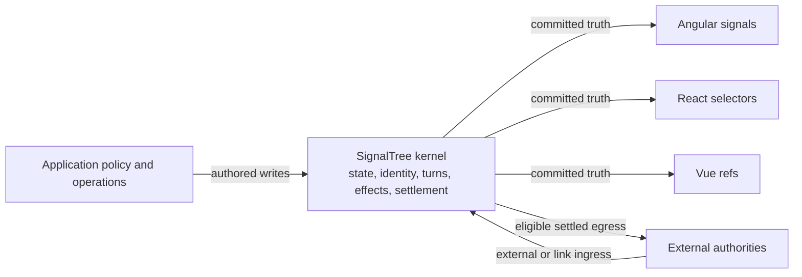
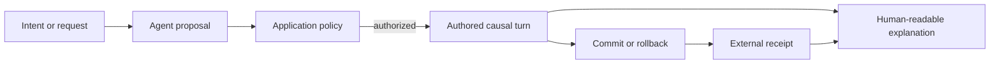

# Beyond Snapshots

## Causal State for Reactive Applications

**Author:** Jonathan D. Borgia  
**Publication draft:** 1.0, September 2026  
**Product baseline:** SignalTree 15.0.0

> **Status:** Technical paper. This document explains the shipped SignalTree 15
> model and the business problem it addresses. It is not an API reference, a
> promise that SignalTree prevents the incidents discussed here, or a substitute
> for application policy, authorization, durable infrastructure, or human review.

---

## Abstract

Most application state systems are very good at answering one question: what is
true now? That sounds complete until two operations arrive at the same value and
the application is still expected to know whether it may undo it, synchronize
it, trust it, recover it, or let an automated agent act on it. At that point the
value is no longer the entire answer. The path into it matters, and once that
path has been thrown away, no selector, better-formatted log, or sufficiently
confident language model can recover it from the snapshot with certainty.

SignalTree 15 starts from that less comfortable premise. It is a
framework-neutral state kernel that keeps canonical state, structural identity,
causal turns, authored and external participation, restoration, pending
transactions, external relationships, settlement, and lifecycle under one
semantic authority. Angular, React, and Vue still observe state through their
native primitives (because asking every framework to pretend it is some other
framework would solve the wrong problem), but none becomes a second store.

This paper develops the information-loss argument behind causal application
state, describes the SignalTree architecture that resulted from it, and then
asks what any of this changes for an actual business. It examines Knight
Capital's 2012 trading failure, Citibank's unintended 2020 Revlon loan payment,
and GitHub's 2018 multi-region database incident, but does so as bounded
counterfactual analysis rather than attribution. None of those systems used
SignalTree, and no client-state library would have repaired their infrastructure,
governance, or operational failures. The useful question is narrower: when an
application does own the next decision, which facts must still exist for its
policy to make that decision safely?

Nor is the result a claim that causality is unique to SignalTree. A team can
assemble the same responsibilities around another state container, just as it
can build its own undo stack, entity identity system, synchronization layer,
framework adapters, audit journal, and AI receipts. SignalTree's claim is that
those responsibilities work better when they share one authority and one
settlement model instead of meeting for the first time at the point where
something has already gone wrong.

---

## Executive Summary

A snapshot describes a value, which is often all a screen needs. A business
operation, however, also has an origin, a scope, an identity, a way it
participates in the application, and some point at which its consequences become
settled. Those facts decide what may be reversed, what may be sent outside the
process, which object a retained reference still means, and whether the next
operation is safe or merely looks safe from where the application is standing.

SignalTree 15 addresses this problem through one integrated model:

1. **One canonical state authority.** The kernel owns state and writes.
   Framework packages own observation, lifecycle integration, and rendering
   behavior.
2. **Causal turns rather than isolated assignments.** Related writes can be
   treated as one operation and published coherently.
3. **Authored work and external truth remain different.** A server response,
   sensor reading, or subscription update does not silently become something the
   application claims it authored.
4. **Identity is not reduced to current value or current key.** EntityMap keeps
   collection membership and stable entity handles inside the same state model.
5. **Restoration and pending rollback use the same causal substrate.** Undo does
   not need a second store, and a rollback can refuse rather than erase later
   valid work.
6. **External synchronization has an explicit boundary.** `link()` connects an
   owned state location to pull, push, and subscription endpoints while preserving
   kernel authority.
7. **Explanations are projections, not truth.** Products may render audit trails
   or AI explanations from causal facts without storing generated prose as the
   authority for what happened.

The business value is not "more metadata," because more metadata is not much of
a business case. The value is having fewer places where recovery,
synchronization, audit, rendering, and autonomous execution quietly invent
different answers to the same question, each of them internally reasonable and
all of them incompatible once they have to work together.

The maximum claim is narrower than necessity. Separate application-owned
journals, identity registries, operation groupers, and observation coordinators
can preserve equivalent distinctions when their contracts are complete and
correctly synchronized. SignalTree chooses to integrate the state-level facts so
applications do not have to reconcile those mechanisms independently. It
provides facts for policy; it does not become the policy authority. This paper
does not establish that integration is the only possible architecture or the
cheapest choice for every application.

The cost is real. Causal structure consumes code and memory, explicit
classification requires developers to say where authority changes, and a tree
with a bounded lifetime must actually be destroyed when that lifetime ends. A
team that needs three local signals and nothing more should use three local
signals. The argument for SignalTree begins where the application keeps rebuilding
meaning around its state (usually in several places and under several names) and
the cost of that reconstruction exceeds the cost of preserving the meaning once.

---

## How to Read the Claims

This paper uses four labels to keep evidence and interpretation separate.

| Label                            | Meaning                                                                                                                |
| -------------------------------- | ---------------------------------------------------------------------------------------------------------------------- |
| **Established**                  | Shipped behavior supported by current source, public types, tests, and package documentation.                          |
| **Architectural interpretation** | An explanation consistent with established behavior, but not itself a runtime guarantee.                               |
| **Counterfactual**               | A bounded statement about how explicit state could inform an application-owned decision. It is not causal attribution. |
| **Constructed scenario**         | A realistic but hypothetical workflow used to explain the model.                                                       |

The distinction matters most in the incident section. None of the organizations
discussed there used SignalTree. The public records establish what happened at a
high level. They do not establish that SignalTree would have prevented it.

---

# 1. The Information a Snapshot Cannot Contain

## 1.1 State is a projection of history

Let $H$ be the set of possible execution histories and let
$\sigma: H \rightarrow S$ project a history into its final application snapshot.
In ordinary state management, consumers receive $\sigma(h)$ and act from that
value.

Now consider two histories $h_a$ and $h_b$ such that:

$$
\sigma(h_a) = \sigma(h_b)
$$

but the valid next business decision differs:

$$
D(h_a) \neq D(h_b)
$$

No function of the snapshot alone can always recover the right decision. If
$g: S \rightarrow A$ receives the same input for both histories, then
$g(\sigma(h_a)) = g(\sigma(h_b))$. At least one answer must be wrong whenever
the required answers differ.

This is not a performance problem. It is information loss.

## 1.2 Three equal snapshots with unequal meaning

### Authority

Both histories end with:

```text
order.status = "approved"
```

In one history, a person approved the order. In the other, a server response
reconciled the local state. The value is equal. The next valid action may not be.
Undo may reverse the first and must not pretend to reverse the server's decision
in the second. An AI agent may be permitted to amend one and forbidden to amend
the other.

### Operation boundary

Both histories end with:

```text
available = 8
reserved  = 2
```

In one history, one allocation operation committed both values. In the other,
two unrelated writes happened to agree. The final object does not reveal whether
observers saw an intermediate state, whether persistence ran between assignments,
or whether failure could have left the pair inconsistent.

### Identity

Both histories end with:

```text
queue = [B, A, C]
```

In one history, three continuing subjects were reordered. In the other, old rows
were removed and lookalikes were inserted. Equal keys and values do not prove
continuous identity. A retained handle, restoration record, or subscription may
need a different answer.

## 1.3 Decision sufficiency

A representation $R$ is sufficient for a policy $D$ only when:

$$
R(h_a) = R(h_b) \Rightarrow D(h_a) = D(h_b)
$$

Snapshot-only state is sufficient for many views. It is insufficient when a
policy depends on a distinction the snapshot erased. Causal application state is
the practice of retaining only the distinctions that real application behavior
requires before they disappear.

This paper uses "causal" in that application-local sense. It does not claim that
SignalTree implements Lamport clocks, distributed consensus, or a globally
ordered history across services. Those are different problems.[^lamport]

---

# 2. Why the Missing Information Becomes Business Cost

The first sign that a causal fact is missing is rarely dramatic. An undo button
reverts a little too much, a component briefly renders a value that should never
have existed on its own, or a retry sends the same command twice and somebody
adds a guard for it. Each problem looks local, and each local fix can appear
reasonable. The business cost arrives later, when that ambiguity crosses a
boundary and the system on the other side has no reason to know which meaning
the application intended.

| Missing distinction                   | Local failure                                                             | Business exposure                                                      |
| ------------------------------------- | ------------------------------------------------------------------------- | ---------------------------------------------------------------------- |
| Authored decision vs. external truth  | Undo, retry, or automation treats a received fact as locally reversible   | Incorrect reversal, duplicated side effect, misleading audit trail     |
| One operation vs. coincidental writes | Observers see partial state or consequences run too early                 | Oversell, inconsistent pricing, broken approval, difficult recovery    |
| Stable subject vs. current key        | A held reference follows the wrong occupant or loses the original subject | Wrong-row edits, stale UI, invalid restoration, incorrect notification |
| Pending vs. settled                   | Persistence or integration publishes speculative state                    | External systems receive work the application later withdraws          |
| Current state vs. inspection          | Debugging or time-travel state escapes as authoritative data              | Development tooling changes external truth                             |
| Live owner vs. abandoned object       | Subscriptions and histories survive beyond the intended workflow          | Memory pressure, duplicate processing, nondeterministic tests          |

## 2.1 Causality compounds

The same preserved distinction can solve several problems that would otherwise
be assigned to different teams. External origin can keep a server refresh out of
undo history, prevent a pending rollback from discarding realized truth, and
make an audit projection honest. Stable subject identity can support point
updates, retained references, restoration, and UI observation. A settlement
boundary can coordinate rendering, persistence, and egress without each one
inventing its own definition of "done."

That reuse is the economic argument. The value does not come from attaching a
larger envelope to every write and congratulating the system for having more
data. It comes from deciding a meaningful fact once, at the point where the fact
still exists, and allowing every dependent capability to consume the same
answer.

## 2.2 Why hand-rolled layers leave holes

A team can add these capabilities independently:

- an action log for audit;
- a second stack for undo;
- an entity adapter for normalized collections;
- persistence middleware;
- request effects and WebSocket handlers;
- framework-specific stores;
- AI transcripts and generated explanations.

None of these additions is inherently wrong, and a capable team can make every
one of them work. The trouble is that they can all be correct in isolation and
still disagree where they meet. The undo stack calls a server refresh "user
work." The entity adapter uses the current key where history needs the original
membership. Persistence sees the first half of a multi-field operation. A React
mirror disagrees with the Angular source from which it was copied. The AI writes
a perfectly coherent explanation of the wrong operation boundary.

The failure, then, is not that teams are incapable of building causal software
without SignalTree. It is that they pay repeatedly to reconstruct facts that
were available when the write occurred, and they usually discover the missing
piece only after two individually sensible systems are asked to agree.

---

# 3. A Model of Application-Local Causality

## 3.1 A conceptual envelope, not a public record type

A useful conceptual model for one causal turn is:

$$
C_t = (\Delta S_t, O_t, P_t, E_t, I_t, G_t, Q_t)
$$

where:

- $\Delta S_t$ is the state transition;
- $O_t$ is origin, such as external, restoration, inspection, or ordinary
  application authorship;
- $P_t$ is participation in causal mechanisms: authored, realized, or
  inspection;
- $E_t$ is the ordered set of scalar or structural effects;
- $I_t$ is the relevant location and subject identity;
- $G_t$ is grouping, including transaction attribution where present;
- $Q_t$ is settlement state for consequences such as external egress.

**Architectural interpretation:** SignalTree does not expose this tuple as a
general-purpose event log, nor does every configuration retain every field.
These dimensions live in separate internal authorities and are consumed by the
capabilities that need them. The notation exists to show why collapsing them
into a final object loses information.

## 3.2 State authority

**Established:** A SignalTree instance is the canonical authority for its state.
Root, branch, and terminal locations read and replace whole values through the
recursive `$` facade. The state shape is the API:

```typescript
const tree = signalTree({
  order: {
    status: 'draft',
    total: 0,
  },
});

tree.$.order.status();
tree.$.order.status('approved');
tree.$.order((order) => ({ ...order, total: order.total + 25 }));
```

There are no required action classes, reducers, selector names, or string paths
for ordinary reads and writes. This removes ceremony; it does not remove causal
semantics. The write still passes through the kernel's location and commit
machinery.

## 3.3 Origin and participation are separate axes

**Established:** `external()` declares that the authoritative decision came from
outside the current authored operation. It also marks the write as realized.
Origin answers where the decision came from. Participation answers how the write
may take part in restoration and transaction behavior.

```typescript
const rows = await api.list();

external(() => {
  tree.$.rows.setAll(rows);
});
```

The acquisition is asynchronous. Applying the result is synchronous. SignalTree
rejects an async `external()` callback because a write after `await` would land
after the classification scope ended.

This boundary is semantic, not geographic. A value calculated in a worker can
remain authored if the application delegated computation but retained the
decision. A sensor reading can be external even when it arrives in the same
process.

SignalTree does not identify a human principal, validate a token, or decide
authorization. If a product must know which person, service, model, or policy
made a decision, that identity belongs in application state or its durable audit
system.

## 3.4 Turns and effects

**Established:** SignalTree records state changes inside causal turns. Structural
collection effects distinguish add, remove, and re-key operations and carry the
subject identity involved. Scalar effects retain the location and transition
needed by configured causal capabilities.

A turn is not merely a timestamp window. `undoable()` designates the current
synchronous authored turn for restoration; it does not create a new turn. Two
designations in one event can therefore belong to one undo step. If a product
needs separate steps, it must provide separate operation boundaries.

## 3.5 Settlement

**Established:** A committed value and an acknowledged external consequence are
not the same fact. A `link()` serializes outbound values after eligible committed
work and exposes `settled()` so an application can wait until in-flight egress
has completed. Transactions distinguish pending work from confirmed work.

Settlement is tree-local. SignalTree does not create a global commit across
multiple trees, databases, services, or payment rails.

## 3.6 Address, key, and subject

An address says where a value can be found now. A key identifies the current
member under a collection's lookup rule. A subject identifies the membership
lifetime to which an acquired handle belongs. These concepts overlap during the
ordinary case and separate under removal, key reuse, re-keying, restoration, and
long-held observation.

**Established:** EntityMap preserves stable entity handles across ordinary
updates and supports `changeId(from, to)` without remove-and-add identity loss.
The exact internal identity carrier is not public API. The product guarantee is
observable: collection structure and the identity of an acquired member do not
have to be inferred from equal values.

---

# 4. SignalTree 15 Architecture

## 4.1 One kernel, native observation



The package boundary makes the ownership rule concrete.

| Package                | Responsibility                                                                                                                    |
| ---------------------- | --------------------------------------------------------------------------------------------------------------------------------- |
| `@signal-tree/kernel`  | Framework-neutral state, EntityMap, causal turns, links, restoration, transactions, batching, diagnostics, and explicit lifecycle |
| `@signal-tree/angular` | Angular-native writable and readonly signal carriers, dependency injection, and owner-bound teardown                              |
| `@signal-tree/react`   | Owner-bound React observation through `useSignalTree` and synchronous selector snapshots, including server rendering              |
| `@signal-tree/vue`     | Vue-native refs and computed refs over kernel-owned state                                                                         |

Angular, React, and Vue do not receive copied stores. They observe the same
canonical kernel truth through framework-native contracts. This avoids a second
state authority while retaining each framework's normal rendering model.

## 4.2 Construction is declarative

State, enhancers, and derived values are declared in one call:

```typescript
const tree = signalTree(initialState, {
  enhancers: [batching(), restoration(), transactions()],
  derived: ($) => ({
    approvedCount: () => $.orders.where((order) => order.status === 'approved')().length,
  }),
});
```

There is no late `.with()` phase. The kernel sees the complete capability set
before materialization, validates enhancer requirements, and can omit optional
machinery that the tree did not request.

## 4.3 Framework-native does not mean framework-owned

In Angular, terminal leaves are `WritableSignal<T>` values and derived leaves
are `Signal<T>` values. In Vue, they are `Ref<T>` and `ComputedRef<T>`. React
uses `useSignalTree(owner, selector)` over the canonical external store and
provides the same selector snapshot during server rendering.

The frameworks own observation mechanics. The kernel owns values, identity,
writes, and causal interpretation. That separation lets an application use one
state model without forcing every framework to imitate another framework's
primitive.

## 4.4 Explicit lifetime

A tree owns subscriptions, history, and realization resources until
`destroy()` releases them. Dropping a local reference is not the same ownership
event.

```typescript
const tree = signalTree({ value: 1 });

try {
  tree.$.value(2);
} finally {
  tree.destroy();
}
```

Application-root stores may live for the process lifetime. Component, route,
server-request, test, and temporary-workflow trees have bounded owners and must
be destroyed at that boundary. Angular's `defineStore` binds this cleanup to
`DestroyRef`; direct kernel construction remains the caller's responsibility.

---

# 5. The Integrated Causal Capabilities

## 5.1 EntityMap: identity inside collection state

EntityMap is a normalized collection integrated with the same write and causal
model as scalar state. It supports point lookup, reactive projections, structural
operations, stable acquired handles, ordered membership, and re-keying.

```typescript
type Order = {
  id: string;
  status: 'draft' | 'pending' | 'approved';
  total: number;
};

const tree = signalTree({
  orders: entityMap<Order, string>({ selectId: (order) => order.id }),
});

tree.$.orders.addOne({ id: 'A-104', status: 'draft', total: 250 });
tree.$.orders.byIdOrFail('A-104').status('pending');
```

The business consequence is not merely faster keyed access. A held row can keep
meaning the same membership while its fields change. Structural restoration can
refer to the subject that changed rather than guessing from the current array
position.

## 5.2 Restoration: reverse designated authored work

`restoration()` retains designated causal turns. `undoable()` marks the current
synchronous authored turn as eligible for undo and redo.

```typescript
const tree = signalTree({ document: { title: 'Draft' } }, { enhancers: [restoration({ maxHistorySize: 50 })] });

undoable(() => {
  tree.$.document.title('Submitted proposal');
});

tree.undo();
tree.redo();
```

External truth does not become an authored undo step, even if it arrives while
an `undoable()` scope is active. That is the authority boundary restoration must
respect.

Restoration is not event sourcing. It does not make the client store a durable
system of record, and it does not promise a legally sufficient audit trail. It
retains state effects for the configured history window so application-owned
work can be reversed coherently.

## 5.3 Transactions: pending authority with conservative rollback

`transactions()` adds an explicit pending operation. The callback applies an
optimistic state transition; the returned handle can confirm it or attempt to
roll it back.

```typescript
type PendingOrder = {
  id: string;
  status: 'draft' | 'pending';
};

const tree = signalTree({ order: { id: 'A-104', status: 'draft' } as PendingOrder }, { enhancers: [transactions()] });

const pending = tree.transaction(() => {
  tree.$.order((order) => ({ ...order, status: 'pending' }));
});

try {
  await api.submit(tree.$.order());
  pending.confirm();
} catch {
  pending.rollback();
}
```

Rollback is conservative. If later confirmed or externally realized work
depends on state the rollback would invalidate, SignalTree can refuse with a
structured `SignalTreeRollbackError` rather than pretend the rollback succeeded.
That refusal is a correctness result. Application policy still decides what to
show the user and how to recover.

## 5.4 Batching: coherent notification without new authority

`batching()` coalesces observation notifications for grouped writes. It reduces
intermediate rendering and effect work; it does not create distributed
atomicity, durable rollback, or authorization.

The distinction matters. Batching answers when observers are notified.
Transactions answer whether pending authored work is confirmed or withdrawn.
Restoration answers which authored turns are retained for later reversal. One
word such as "atomic" is too imprecise to stand in for all three.

## 5.5 Link: one external relationship

`link(source, endpoint)` connects an owned SignalTree location to an endpoint
that may provide pull, push, or subscription behavior.

```typescript
const connection = link(tree.$.orders, {
  get: () => api.listOrders(),
  set: (orders) => api.saveOrders(orders),
  subscribe: (next) => stream.onOrders(next),
});

await connection.retrieve();
await connection.settled();
connection.dispose();
```

The handle deliberately has three methods:

- `retrieve()` pulls once;
- `settled()` waits for outbound acknowledgements already in flight;
- `dispose()` ends the relationship.

Link is not a generic request framework. It does not own retries, status models,
cache policy, storage formats, or business validation. It exchanges complete
values at the relationship boundary even when the tree's internal observation is
granular. Failed outbound writes are reported through `onTreeError`; the tree
does not silently rewrite its authored state to make a failed endpoint look
successful.

## 5.6 Explanation is a projection

The kernel preserves semantic facts needed by state behavior. It does not store
human prose as causal truth. An application can project those facts into:

- an audit timeline;
- an operator explanation;
- an AI-readable receipt;
- a support diagnostic;
- a review summary.

Those projections may evolve, localize, or become more useful without rewriting
the facts from which they were produced. A convincing explanation is not proof
that the underlying operation was authorized or coherent.

---

# 6. A Worked Business Flow

Consider a commerce application that allows an operator to approve an order
while stock and fraud state continue arriving from external systems.

## 6.1 The state

```typescript
type Order = {
  id: string;
  status: 'draft' | 'pending' | 'approved' | 'rejected';
  total: number;
};

type Stock = {
  sku: string;
  available: number;
};

const store = signalTree(
  {
    orders: entityMap<Order, string>({ selectId: (order) => order.id }),
    stock: entityMap<Stock, string>({ selectId: (item) => item.sku }),
    fraudPolicyVersion: '',
  },
  {
    enhancers: [batching(), restoration(), transactions()],
  }
);
```

## 6.2 External realization

The application fetches stock and applies it as externally authoritative state:

```typescript
const stock = await inventoryApi.list();
external(() => store.$.stock.setAll(stock));
```

This does not mean the inventory service is infallible. It means the current
operation did not author the inventory observation and restoration must not
claim it as the operator's reversible work.

## 6.3 Pending approval

The application evaluates its own policy first. SignalTree does not supply this
policy.

```typescript
if (!canApprove(store.$(), orderId)) {
  throw new Error('Approval policy rejected this order');
}

const pending = store.transaction(() => {
  store.$.orders.updateOne(orderId, { status: 'pending' });
});

let result: { status: Order['status'] };
try {
  result = await orderApi.approve(orderId);
} catch (error) {
  pending.rollback();
  throw error;
}

pending.confirm();
external(() => {
  store.$.orders.updateOne(orderId, { status: result.status });
});
```

The example is intentionally incomplete. Production code still needs
authorization, idempotency, timeout and retry policy, server-side validation,
and an answer for rollback refusal. What SignalTree contributes is a state model
in which the pending local decision and the returned external fact do not have to
pretend they are the same kind of write.

## 6.4 Business outcome

The operator sees one coherent status transition. A server response does not
become an undoable human action. If later truth makes rollback unsafe, the
application receives an explicit refusal rather than a fabricated success. An
audit projection can distinguish what the operator requested from what the
server accepted.

That does not guarantee a correct order. It makes the facts required by order
policy available at the point where the application owns a decision.

---

# 7. Public Incidents as Bounded Counterfactuals

## 7.1 Method and boundary

The following systems did not use SignalTree, and presenting their losses as
evidence that they should have would be both easy and wrong. Public postmortems
and legal records rarely expose enough implementation detail to diagnose a
missing state abstraction, particularly from outside the organization and years
after the fact. Each case is therefore divided into four parts:

1. what the public record establishes;
2. the application-state question it raises;
3. a bounded counterfactual for an application-owned control surface;
4. what SignalTree could not have prevented.

The incidents are not endorsements, customer stories, or causal attributions.
They are examples of the point at which a value stopped being enough to explain
what the system should do next.

## 7.2 Knight Capital: action continued after the market had answered

### Public record

The U.S. Securities and Exchange Commission reported that an incorrect software
deployment activated defective dormant code in Knight Capital's automated equity
router on August 1, 2012. During the first 45 minutes after the market opened,
the router sent more than four million orders while attempting to fill 212
customer orders, traded more than 397 million shares, accumulated billions of
dollars in unwanted positions, and produced a loss exceeding $460 million. An
internal system generated 97 automated emails identifying a router error before
the market opened, but the messages were not designed or handled as system
alerts.[^knight]

The SEC identified missing and inadequate controls immediately before market
submission, controls unable to enforce aggregate capital thresholds, an account
not linked to automated firm-exposure controls, and deployment and incident
response failures.[^knight]

### Application-state question

Could an application-owned control surface keep customer intent, generated child
order identity, external fill acknowledgements, active operating mode, and
aggregate exposure in one settled state that policy must consult before another
order leaves?

### Bounded counterfactual

**Counterfactual:** If such a control point exists, SignalTree can represent
child orders as stable subjects, classify market acknowledgements as external
truth, and publish related exposure changes coherently. Application policy could
compare requested work with generated work and refuse the next submission when
an invariant fails.

### Honest boundary

SignalTree would not have repaired the deployment, removed dormant code,
supplied pre-trade risk limits, converted emails into operational alerts, or
stopped an order without an application control that consulted the state. State
representation changes nothing when no policy owns the next action.

## 7.3 Citibank and Revlon: valid transfer data, wrong business operation

### Public record

Citibank served as administrative agent for lenders on a $1.8 billion,
seven-year syndicated loan to Revlon. On August 11, 2020, it made an accidental
and unintended early repayment. Some recipients refused to return the funds. A
district court ruled for the recipients under New York's discharge-for-value
rule. The Second Circuit vacated that judgment in 2022, holding that the
recipients had notice of the mistake and were not entitled to repayment at that
time; the debt was not due for another three years.[^citibank]

The opinion establishes an unintended payment and the legal dispute that
followed. It does not establish that a particular missing client-state primitive
caused the payment.

### Application-state question

Can an application keep requested operation, present entitlement, approval
scope, and external settlement as separate facts, even when they share one
amount and the payment rail accepts the instruction?

### Bounded counterfactual

**Counterfactual:** Where the application owns pre-submit review, SignalTree can
hold authored intent, due-date state, reviewer actions, and returned settlement
without collapsing them into one value. Application policy can then require
those facts to agree before egress.

### Honest boundary

SignalTree cannot decide contract interpretation, authenticate an approver,
reverse a settled transfer, govern a bank, or replace payment rails. It also
cannot prove from the public record that missing causal state was the root cause.
The narrow claim is that a policy-owned decision is safer when operation,
entitlement, approval, and settlement have not already been compressed into one
status.

## 7.4 GitHub: locally valid regions, globally incompatible truth

### Public record

GitHub reported that routine maintenance on October 21, 2018 caused a 43-second
network partition between its U.S. East Coast network hub and primary East Coast
data center. Automated failover promoted West Coast database clusters while
some East Coast writes had not replicated. When connectivity returned, each
region contained writes absent from the other. GitHub chose a fail-forward
recovery to protect data integrity, producing 24 hours and 11 minutes of degraded
service.[^github]

During recovery, GitHub paused webhook delivery and Pages builds. More than five
million webhook events and 80,000 Pages builds queued. Approximately 200,000
webhook payloads exceeded an internal time-to-live and were dropped before the
TTL was increased.[^github]

### Application-state question

How should application and operator surfaces represent write authority, replica
freshness, queue identity, expiration, and recovery settlement while the
infrastructure is degraded?

### Bounded counterfactual

**Counterfactual:** SignalTree can represent externally reported authority and
application-defined freshness without making the client their source of truth.
EntityMap can preserve queued-subject identity, and a settled state can keep UI
or operator actions from treating known-stale data as current. Endpoint policy
can consult that state before acting.

### Honest boundary

SignalTree cannot prevent a network partition, fix replication, elect a primary,
increase restore throughput, reconcile divergent databases, or choose a queue
TTL. Those are infrastructure and product-policy responsibilities. Its narrower
role is to keep a known authority or freshness distinction available to an
application that owns a subsequent decision.

## 7.5 What these incidents establish together

Taken together, these incidents do not establish that causal client state
prevents catastrophic failures. They establish something more modest and, for
an application designer, more useful: expensive failures often pass through a
point where every value is technically valid and the relationship between those
values is not.

- Knight Capital needed controls to relate intent, generated action,
  acknowledgement, and aggregate exposure.
- Citibank's valid transfer data did not make the business operation intended or
  presently due.
- GitHub's regional data could be locally readable while known to be stale or
  incompatible with another authority.

When application policy owns a decision at one of those boundaries, preserving
the relevant distinction is a precondition for making the policy enforceable.
When it does not own the decision, preserving more state may improve the
explanation, but it does not create control where none exists.

---

# 8. Constructed Business Scenarios

The following scenarios are hypothetical, but the work in them is intentionally
ordinary: a dispatcher changes a route, a store reserves inventory, and an AI
assistant recommends an approval. None needs a spectacular failure to matter.
They show how the same causal model affects day-to-day business systems without
borrowing the scale or authority of a public incident.

## 8.1 Logistics: an AI-assisted route replan

A dispatch platform has a route with thirty stops when a traffic service reports
a closure. An optimization model proposes moving three deliveries, a dispatcher
accepts two of them, and one driver has already acknowledged the original
sequence. By the time the screen shows the final route, four different
authorities have participated and only one of them actually chose the plan.

### Snapshot-only failure

The final route array shows the new order. It does not reveal which changes came
from traffic, which were proposed by the model, which the dispatcher accepted,
or which stop identities survived the reorder. A retry can send duplicate
notifications. Undo can restore the route while accidentally treating the
traffic report as authored work.

### Causal design

- Traffic enters as external truth.
- Stops remain stable EntityMap subjects while sequence or assignment changes.
- The accepted replan is one authored operation.
- Driver acknowledgement arrives as a separate external realization.
- Restoration applies only to the dispatcher-owned change.
- Notification policy runs after the accepted operation settles.

### Business effect

Customer windows, driver instructions, and support history can continue to refer
to the same stop after the route moves. More importantly, the dispatcher can
reverse the plan they authored without the software pretending that they also
reversed the road closure or withdrew the driver's acknowledgement.

### Boundary

SignalTree does not optimize the route, validate legal driving hours, guarantee
GPS accuracy, or deliver the notification. Those remain model, policy,
infrastructure, and operational concerns.

## 8.2 Commerce: inventory reservation under delayed supplier events

An order reserves two units while a supplier feed reports replenishment. One
supplier event is duplicated, another arrives out of order, and the resulting
quantity still happens to look reasonable. This is exactly the sort of failure
that survives a dashboard check because the number is plausible even when the
history that produced it is not.

### Snapshot-only failure

The final quantity may look plausible while hiding whether stock was received,
reserved, committed, duplicated, or corrected. A UI can show inventory that
does not match the operation the checkout service is about to authorize.

### Causal design

- Inventory observations enter as external truth.
- Reservations are authored operations with explicit transaction boundaries.
- Orders and supplier events have stable application-level IDs stored in
  EntityMaps.
- Application policy owns deduplication, ordering, and idempotency.
- The checkout decision reads settled inventory and reservation state.

### Business effect

Rendering, reservation, and outbound integration agree about which state is
pending and which state was externally realized. Support can explain why an
order was refused without reconstructing the sequence from unrelated logs.

### Boundary

SignalTree does not make a supplier event truthful, deliver a missing message,
or implement idempotency automatically. It gives application policy a coherent
place to represent and use those facts.

## 8.3 AI operations: recommendation is not authorization

An AI assistant reviews a purchase request using current budget, vendor status,
and policy, then recommends approval. A human rejects it, the budget changes
later, and a second reviewer approves the same request. The final state is
simple. Explaining honestly how it became final is not.

### Snapshot-only failure

The final status says `approved`. A transcript may contain all three decisions,
but prose does not establish which state each actor saw, whether the budget was
current, or which operation became authoritative.

### Causal design

- Budget and vendor status enter as external truth.
- The AI output remains a proposal projected from a specific state.
- The human decision is an authored operation.
- Approval and related fields publish as one settled change.
- Application state stores the actor, model, policy version, and source
  timestamps required by the organization's audit standard.

### Business effect

The product can distinguish recommendation, rejection, later evidence, and final
approval. A reviewer can inspect the facts without treating generated prose as
the record of authority.

### Boundary

SignalTree does not make the model correct, authenticate the reviewer, define
procurement policy, or certify compliance. It supplies state semantics on which
those systems can operate.

---

# 9. AI Raises the Price of Missing Causality

An automated agent can read more state, make more related writes, retry faster,
and explain itself more convincingly than a human operator. That is why it is
useful. It is also why the old habit of treating a final snapshot as a complete
record becomes more dangerous: the agent can cross several boundaries before a
person has even seen the first one.

A safe application flow separates five things:



## 9.1 The agent should not become the state authority

The model may propose an operation, but a proposal is not an authorization simply
because it is detailed, formatted, and persuasive. Application code should
translate an accepted proposal into a typed command, evaluate policy, and apply
one explicit state operation. The model's text is input to that process, not the
commit log and certainly not proof that the operation was allowed.

## 9.2 Receipts matter more than explanations

An explanation can say "the refund succeeded" before the payment provider has
accepted anything, and it can say so in language polished enough that a person
believes it. The state model should keep requested work, pending work, and the
external receipt distinct. The explanation can then be regenerated from facts
that survived instead of being trusted because it sounded finished.

## 9.3 Retry must preserve operation identity

Network uncertainty makes "failed" ambiguous. The request may have failed to
leave, failed in transit, succeeded remotely with a lost response, or been
rejected. SignalTree does not provide distributed idempotency, but it can keep
the local operation identity and settlement state that application retry policy
needs.

## 9.4 Reversibility is bounded by authority

An agent may be allowed to reverse a local draft and forbidden to reverse a
server-confirmed shipment. Restoration should therefore follow authored
eligibility, not a generic rule that every previous snapshot is recoverable.

## 9.5 A practical agent contract

Before an agent-triggered operation commits, the application should be able to
answer:

1. Which authority supplied each decision input?
2. Which inputs have freshness or expiry policy?
3. Which writes form the one operation being approved?
4. Which subject does each retained reference identify?
5. Is the operation pending, confirmed, refused, or externally realized?
6. What may be restored without discarding later valid work?
7. Which explanation is derived presentation rather than authority?

SignalTree supplies part of this substrate. The application supplies actor
identity, authorization, validation, idempotency, durable audit, and the policy
that decides whether to proceed.

---

# 10. The Honest Competitive Position

Can another library support causal application state? Of course. Software is not
made impossible by choosing a different package; the responsibilities simply
have to live somewhere, and the interesting question is whether they share a
model or meet later through application code.

| Approach                    | What it naturally provides                                 | What must be added for this model                                                                                                       |
| --------------------------- | ---------------------------------------------------------- | --------------------------------------------------------------------------------------------------------------------------------------- |
| Framework signals or refs   | Fine-grained values and native observation                 | Turn meaning, external authority, restoration policy, stable collection subjects, external settlement                                   |
| Reducer or action stores    | Explicit commands and reproducible state transitions       | Subject lifetime, framework-native carriers, external-truth classification, restoration and settlement semantics if not already modeled |
| Event sourcing              | Durable domain events and replay around a system of record | Client-local native observation, pending UI state, bounded lifecycle, and application presentation state                                |
| Workflow engines            | Durable process state, retries, and business orchestration | Fine-grained local application state and framework rendering integration                                                                |
| CRDTs or consensus systems  | Multi-writer convergence or distributed agreement          | Application-local authorship, undo eligibility, UI identity, and framework observation                                                  |
| Logs and distributed traces | Retrospective evidence about execution                     | Mutation authority and behavior that acts on causal facts before the next decision                                                      |

These categories compose. A SignalTree application can use an event-sourced
backend, a workflow engine, OpenTelemetry, and a CRDT (and, in a sufficiently
complicated system, may use all four). SignalTree does not replace them. It
addresses the state semantics inside one application ownership boundary, which
is smaller than a distributed system and still large enough for meaning to get
lost.

The defensible product claim is therefore not exclusivity:

> SignalTree ships an integrated causal state model. A hand-rolled alternative
> can provide the same value, but it must make the same distinctions and keep
> them coherent across every capability that depends on them.

---

# 11. Cost, Performance, and Evidence Discipline

## 11.1 Bundle cost

The authoritative bundle gate is
[`tools/check-bundle-budget.mjs`](../../tools/check-bundle-budget.mjs). It builds
consumer-shaped production bundles with framework peers and `tslib` external,
minifies them, and reports gzip size for SignalTree-owned code.

At the SignalTree 15.0.0 baseline used for this paper:

| Consumer shape                        | Production own-code gzip | Enforced budget |
| ------------------------------------- | -----------------------: | --------------: |
| Bare `signalTree({ count: 0 })`       |                  9.95 KB |         10.0 KB |
| Tree containing a plain `entityMap()` |                 22.01 KB |         22.1 KB |

Reproduce with:

```bash
node tools/check-bundle-budget.mjs
```

These figures do not include framework peers and do not describe network cost
for an entire application. They are boundaries on the code the library adds to
the measured consumer shapes.

## 11.2 Runtime claims are shapes, not slogans

The engineering evidence supports localized point updates that do not
inherently scale with unrelated collection members. It does not support saying
"SignalTree is always O(1)." Collection projection, broad observation,
restoration, transactions, and materialized entity handles have their own costs.

Raw framework signals can be faster and smaller when an application does not
need EntityMap identity, restoration, transaction rollback, or link settlement.
That is not a benchmark failure. It is the price of the abstraction and the
reason adoption should begin with business state that needs the semantics.

The detailed performance record remains in the historical engineering paper and
current generators. This paper does not promote checkpoint latency numbers into
release guarantees.

## 11.3 Lifecycle is part of the cost model

Repeatedly creating bounded-life trees without `destroy()` retains the resources
those trees own. Calling `destroy()` releases them. Phrase this as ownership, not
as a leak: a long-lived application store is supposed to remain live; a request,
test, route, or temporary workflow must release its tree at the ownership
boundary.

## 11.4 Business evidence is not benchmark evidence

No microbenchmark proves fewer incidents, lower support cost, or safer AI
automation. Those outcomes depend on architecture, policy, adoption quality, and
the value of the decisions being protected. Performance measurements establish
that the mechanism fits within declared engineering budgets. They do not price
the business outcome.

---

# 12. Adoption Guidance

## 12.1 Good fit

SignalTree is a strong candidate when an application has several of these
properties:

- long-lived structured state with granular observation;
- keyed collections whose members are retained across updates;
- optimistic operations that may confirm or roll back;
- undo or redo that must exclude external truth;
- ongoing synchronization with APIs, storage, or streams;
- multiple framework realizations over one domain model;
- operator or AI workflows that need reviewable operation boundaries;
- bounded server-rendering, route, test, or temporary ownership scopes.

## 12.2 Probably too much

A simpler tool is usually better when state is short-lived, local to one
component, easy to recompute, never synchronized, never restored, and has no
identity beyond its current value. Causal machinery should protect meaningful
decisions, not decorate every boolean.

## 12.3 Start from authority, not API substitution

Do not migrate a legacy store method by method. First identify:

1. Which domain facts belong to one state authority?
2. Which writes are authored here and which are realized from elsewhere?
3. Which operations must publish coherently?
4. Which subjects retain identity across structural change?
5. Which authored work is legitimately reversible?
6. Which external relationships require settlement and disposal?
7. Who owns the tree's lifetime?

Then choose the smallest SignalTree surface that serves those answers.

## 12.4 Use one framework facade

Angular applications import from `@signal-tree/angular`, React applications from
`@signal-tree/react`, and Vue applications from `@signal-tree/vue`.
Framework-neutral libraries and runtimes import from `@signal-tree/kernel`.
Mixing a framework facade with direct kernel construction in application code
weakens the ownership boundary the package split exists to provide.

## 12.5 Keep policy outside the kernel

An Ops service or equivalent application layer should own asynchronous work,
authorization, validation, retries, and business commands. Components normally
receive read-only state plus explicit operations. SignalTree represents and
transitions state; it does not decide whether a payment, trade, dispatch, or AI
action is permitted.

## 12.6 Test the missing distinctions

High-value tests should prove behavior where equal snapshots could hide unequal
meaning:

- an external refresh is not undone as authored work;
- one operation does not publish an impossible intermediate state;
- a retained entity handle does not silently follow a different membership;
- a pending rollback refuses when later valid work would be discarded;
- an inspection state does not escape through external egress;
- a bounded-life tree releases its resources at teardown;
- each framework observes the canonical kernel value without a mirror store.

---

# 13. Limitations and Non-Claims

These boundaries are part of the architecture, not footnotes.

## 13.1 SignalTree does not infer business meaning

The application must classify external truth, designate undoable work, define
transaction boundaries, store actor identity where required, and decide policy.
Incorrect classification produces incorrect semantics more consistently; no
library can infer authority from a network call or function name.

## 13.2 SignalTree is not a durable event store

Restoration history is bounded application state. It is not an immutable legal
ledger, an event-sourced backend, or a replacement for database audit records.

## 13.3 SignalTree is not a distributed-systems protocol

It does not provide consensus, replication, vector clocks, CRDT convergence,
exactly-once delivery, or cross-service transactions. Application-local causal
state can represent information reported by those systems; it cannot create
their guarantees.

## 13.4 SignalTree is not authorization or policy

It does not authenticate users, evaluate entitlements, approve payments, impose
market risk limits, validate driving rules, or decide whether an AI operation is
safe. Those systems can consult SignalTree state, but they remain independently
required.

## 13.5 SignalTree does not own persistence or async orchestration

Version 15 publishes no persistence, serialization, request, cancellation,
retry, form-control, or cache-policy capability. Applications compose those
concerns through ordinary state, services, framework facilities, and `link()`
where an ongoing external relationship exists.

## 13.6 SignalTree is not free

Entity identity, causal capture, restoration, and framework realization consume
bundle, CPU, and memory. Materializing and retaining a handle for every entity in
a very large collection has a cost. Measure the application workload, retain
only the nodes consumers need, and do not use causal machinery where plain local
state is sufficient.

## 13.7 The incident counterfactuals are deliberately narrow

Nothing in this paper claims that SignalTree would have prevented the Knight
Capital, Citibank, or GitHub incidents. The claim is conditional:

> If an application owns a decision, and if the policy for that decision depends
> on origin, operation boundary, identity, freshness, or settlement, then those
> distinctions must still exist when the policy runs.

SignalTree is one implementation of that requirement.

---

# 14. Conclusion

Reactive state made values observable, which was an enormous improvement over
manually keeping every dependent view in sync. Modern applications have simply
reached the next version of the same problem: some transitions carry meaning
that also needs to remain observable.

A person and a server can produce the same status. One allocation and two
unrelated assignments can produce the same inventory. A reordered subject and a
replacement can produce the same array. A pending local operation and a settled
external effect can produce the same screen. Everything can look right and the
next valid action can still be different.

SignalTree 15 treats that problem as architecture rather than as a collection of
features added around a store. State, identity, causal turns, external authority,
restoration, pending transactions, settlement, and framework observation meet
under one kernel-owned model. The application still owns policy, infrastructure
still owns durability and distributed truth, and humans still own judgment
(which is fortunate, because none of those responsibilities becomes optional
when the state model improves).

The integrated model does not make failure impossible. It does something less
dramatic and more useful: it makes fewer decisions depend on facts the
application already threw away, and fewer teams rediscover those facts only
after they need them.

That leaves the question every state architecture should answer:

> **What are you losing that you do not even know about?**

The engineering test is concrete: identify every policy for which equal
snapshots require different actions, then preserve the minimum distinguishing
facts before the snapshot projection discards them.

---

# Appendix A: Shipped Invariants and Evidence

| Claim                                                            | Current evidence                                                                                                                              |
| ---------------------------------------------------------------- | --------------------------------------------------------------------------------------------------------------------------------------------- |
| One construction grammar and recursive `$` facade                | [Kernel package guide][kernel-guide] and [package public exports][kernel-index]                                                               |
| EntityMap normalized collections and stable handles              | [EntityMap implementation][entity-source], [entity behavior tests][entity-spec], and [physical handle-resolution tests][entity-handle-spec]   |
| External origin and realized participation are distinct          | [`external.ts`][external-source], [restoration-origin tests][restoration-origin-spec], and [transaction tests][transaction-spec]              |
| `undoable()` designates a synchronous authored turn              | [`undoable.ts`][undoable-source] and [restoration behavior tests][restoration-spec]                                                           |
| Transactions expose confirm and rollback                         | [Transaction public types][transaction-types] and [transaction tests][transaction-spec]                                                       |
| Link supports pull, push, subscription, settlement, and disposal | [`link.ts`][link-source], [public-contract tests][link-public-spec], and [production conformance tests][link-conformance-spec]                |
| Kernel owns truth while frameworks own observation               | [Framework-neutrality evidence][framework-neutrality], [Angular guide][angular-guide], [React guide][react-guide], and [Vue guide][vue-guide] |
| Bounded-life trees require explicit teardown                     | [Kernel lifetime guidance][kernel-guide] and [`probe-history-sample-isolation.mjs`][lifecycle-probe]                                          |
| Production bundle ceilings are enforced                          | [`tools/check-bundle-budget.mjs`][bundle-gate]                                                                                                |

The earlier
[SignalTree v15 engineering whitepaper][engineering-whitepaper] remains the
chronological record of architecture experiments, corrections, and RC1 evidence.
It is historical context, not the authority for current public API.

---

# Appendix B: Glossary

**Application authority**  
The ownership boundary within which SignalTree is the canonical state source.
It does not imply authentication or legal authority.

**Authored write**  
Ordinary application work whose decision belongs to the current operation.

**External truth**  
A value whose authoritative decision came from outside the current authored
operation and is synchronously applied through `external()` or Link ingress.

**Participation**  
How a write may take part in causal mechanisms: authored, realized, or
inspection.

**Location**  
An owned root, branch, leaf, or collection access point through which canonical
state is read or written.

**Subject**  
The membership lifetime identified by an acquired entity handle, distinct from
its current key or value.

**Causal turn**  
The operation boundary within which related state effects share causal meaning.

**Effect**  
A scalar transition or structural collection change consumed by configured
causal capabilities. It is not a generic application side effect.

**Settlement**  
The state in which eligible committed work and its in-flight external egress have
reached the boundary exposed by the relevant handle.

**Restoration**  
Retention and reversal of designated authored causal turns.

**Transaction**  
An explicit pending authored operation that may be confirmed or conservatively
rolled back.

**Projection**  
A derived view, including a human-readable explanation, that is computed from
canonical facts and does not become their authority.

---

# Appendix C: Reproduction and Review

From a clean checkout using the repository-pinned Node and pnpm versions:

```bash
pnpm install --frozen-lockfile
pnpm nx test kernel
pnpm nx test angular
pnpm nx test react
pnpm nx test vue
pnpm run typecheck
pnpm run build:all
node tools/check-bundle-budget.mjs
node tools/check-doc-links.mjs
```

The full release pipeline is documented in
[`.github/VALIDATION_GUIDE.md`](../../.github/VALIDATION_GUIDE.md). Current
package types and tests override prose when they disagree. Generated files under
`dist/` and local files under `artifacts/` are not source authority.

Recommended independent review questions:

1. Does each product claim name an observable behavior rather than an internal
   mechanism?
2. Does any incident section imply causation not established by its source?
3. Does any counterfactual assume policy that the application does not own?
4. Does any framework statement accidentally make the framework a second state
   authority?
5. Does any benchmark number omit its generator, workload, or exclusions?
6. Does any explanation become authoritative merely because it sounds complete?

---

# References

[^lamport]: Leslie Lamport, "Time, Clocks, and the Ordering of Events in a Distributed System," _Communications of the ACM_ 21, no. 7 (1978). [Author-hosted PDF](https://lamport.azurewebsites.net/pubs/time-clocks.pdf). SignalTree's application-local use of causality is narrower and does not implement Lamport's distributed ordering model.
[^knight]: U.S. Securities and Exchange Commission, "SEC Charges Knight Capital With Violations of Market Access Rule," Release 2013-222, October 16, 2013. [Press release and order link](https://www.sec.gov/newsroom/press-releases/2013-222).
[^citibank]: _In re Citibank August 11, 2020_, No. 21-487, U.S. Court of Appeals for the Second Circuit, decided September 8, 2022. [Opinion and case summary](https://law.justia.com/cases/federal/appellate-courts/ca2/21-487/21-487-2022-09-08.html) and [opinion PDF](https://cases.justia.com/federal/appellate-courts/ca2/21-487/21-487-2022-09-08.pdf?ts=1662663612).
[^github]: Jason Warner, GitHub, "October 21 post-incident analysis," October 30, 2018. [GitHub post-incident analysis](https://github.blog/news-insights/company-news/oct21-post-incident-analysis/).

[kernel-guide]: ../../packages/kernel/README.md
[angular-guide]: ../../packages/angular/README.md
[react-guide]: ../../packages/react/README.md
[vue-guide]: ../../packages/vue/README.md
[external-source]: ../../packages/kernel/src/lib/external.ts
[undoable-source]: ../../packages/kernel/src/lib/undoable.ts
[kernel-index]: ../../packages/kernel/src/index.ts
[entity-source]: ../../packages/kernel/src/lib/entity-signal.ts
[entity-spec]: ../../packages/kernel/src/lib/entity-signal.spec.ts
[entity-handle-spec]: ../../packages/kernel/src/lib/physical/entity-handle-resolution.spec.ts
[restoration-origin-spec]: ../../packages/kernel/src/lib/restoration-origin.spec.ts
[restoration-spec]: ../../packages/kernel/src/enhancers/restoration/restoration.behavior.spec.ts
[transaction-types]: ../../packages/kernel/src/enhancers/transactions/transactions.types.ts
[transaction-spec]: ../../packages/kernel/src/enhancers/transactions/transactions.spec.ts
[link-source]: ../../packages/kernel/src/lib/link.ts
[link-public-spec]: ../../packages/kernel/src/lib/link-2-public-contract.spec.ts
[link-conformance-spec]: ../../packages/kernel/src/lib/production-link-conformance-0.spec.ts
[framework-neutrality]: ../architecture/v15-framework-neutrality-spike.md
[bundle-gate]: ../../tools/check-bundle-budget.mjs
[lifecycle-probe]: ../../tools/probe-history-sample-isolation.mjs
[engineering-whitepaper]: ./SignalTree_v15_Engineering_Whitepaper_v3.md

---

# Authorship and Editorial Assistance

Jonathan D. Borgia developed the SignalTree architecture, implementation,
experiments, and conclusions represented here. AI tools assisted with editorial
organization, language refinement, source discovery, and adversarial review.
Every technical claim remains subject to verification against the cited source,
current package types, executable tests, and reproducible repository tooling.
